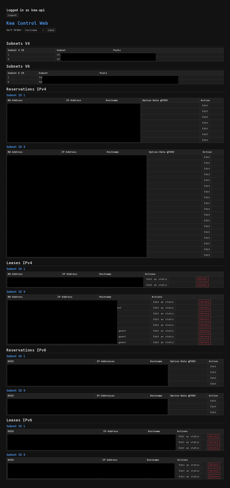

# Kea Control Web

Because not everyone likes the Stork here's a PHP webapp to control your Kea DHCP Server.

Theres minimal styling, minimal JS for adding rows, no magic and uses only the kea-ctrl-agent interface, so what backend you use won't matter.

I wrote it to work with Kea 3.0 which i recommend because the hooks are all available again.

AI: I got the stylesheet and the sort-function from Gemini, rest is done by hand and dblchecked with Gemini. CSRF and XSS is new to me, recommended by Kimi

You need to login with your credentials from the kea-ctrl-agent which will not be stored but in a $_SESSION value for 1 hour.

You can change the KEA_URL in `settings.php`:

```
define('KEA_URL', 'http://127.0.0.1:8000/');
```

no mTLS Support yet, should be easily doable though, feel free to just take it as a blueprint or PR.


If you don't like sth about it you can just take a look at 100 lines of php code in index.php and customize it.

Enjoy!

API: https://kea.readthedocs.io/en/stable/api.html


`/etc/apache2/sites-available/kea-ctlr-web.conf`

```
<VirtualHost *:443>
    ServerName kea-ctrl-web.yourdomain.tld

    DocumentRoot /var/www/kea-ctrl-web

    <Directory /var/www/kea-ctrl-web>
        Require all granted
        DirectoryIndex index.php
    </Directory>

    SSLEngine on
    // Include /etc/apache2/ssl/options.conf - this is: ..
    SSLProtocol -all +TLSv1.2 +TLSv1.3 
    # "TLS session tickets are enabled by default. Using them without restarting the web server with an appropriate frequency (e.g. daily) compromises perfect forward secrecy."
    # More info: https://stackoverflow.com/questions/19939247/ssl-session-tickets-vs-session-ids
    SSLSessionTickets Off
    
    SSLCertificateFile /etc/letsencrypt/live/kea-ctrl-web.yourdomain.tld/fullchain.pem
    SSLCertificateKeyFile /etc/letsencrypt/live/kea-ctrl-web.yourdomain.tld/privkey.pem

</VirtualHost>
```


`kea-ctrl-agent.conf`

```

{
"Control-agent": {
    "http-host": "127.0.0.1",
    "http-port": 8000,
    "authentication": {
        "type": "basic",
        "realm": "Kea Control Agent",
        "directory": "/etc/kea",
        "clients": [
            {
                "user": "kea-api",
                "password-file": "kea-api-password"
            }
        ]
    },
    "control-sockets": {
        "dhcp4": {
            "socket-type": "unix",
            "socket-name": "kea4-ctrl-socket"
        },
        "dhcp6": {
            "socket-type": "unix",
            "socket-name": "kea6-ctrl-socket"
        },
        "d2": {
            "socket-type": "unix",
            "socket-name": "kea-ddns-ctrl-socket"
        }
    },
    "loggers": [
    {
        "name": "kea-ctrl-agent",
        "output-options": [
            {
                "output": "stdout",
                "pattern": "%-5p %m\n"
            }
        ],
        "severity": "INFO",
        "debuglevel": 0
    }
  ]
}
}

```

